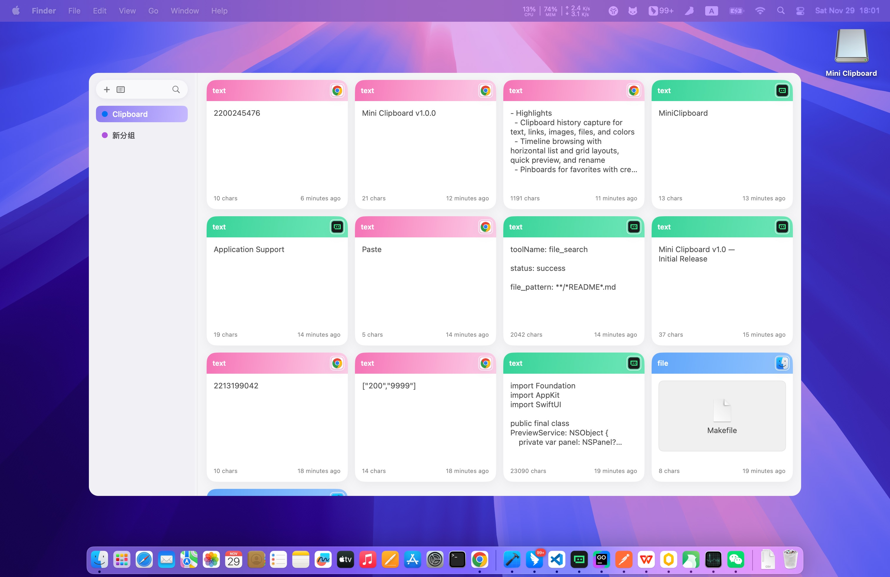
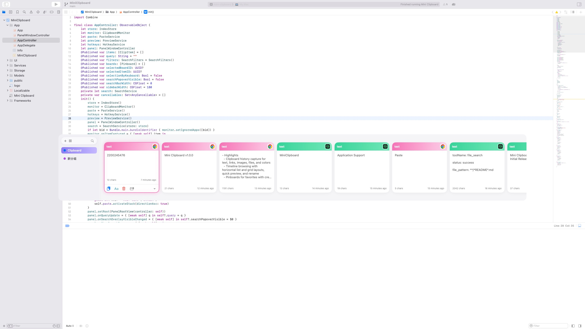

# Mini Clipboard (macOS)

[English](README.en.md) | [中文](README.md)

Lightweight, elegant macOS clipboard manager. Capture history, browse by timeline, pinboards and groups, direct paste, quick paste, instant search, and more — helping you paste content across apps faster.

## Features
- History capture: automatically collects text, links, images, files, colors, and more
- Timeline browsing: horizontal list and grid layouts, quick preview and rename
- Pinboards and groups: create/rename/color pinboards; history and pins are separate
- Direct paste: writes into the system clipboard, supports plain-text paste
- Search and filters: keyword + type/source-app filters, instant-as-you-type
- Settings and shortcuts: history retention period, layout toggle, shortcut mapping

## UI Preview
- Grid layout

- List layout

## Requirements
- macOS 12+ (Apple Silicon native)
- Xcode 15+, Swift 5.9+

## Quick Start
### Using Xcode
- Open `MiniClipboard.xcodeproj`, select the `mini-clipboard` scheme, and run.

### Using Makefile
- Build Debug:
  - `make build`
- Produce distributable `.app`:
  - `make app` → outputs to `dist/Mini Clipboard.app`
- Create unsigned DMG:
  - `make dmg-unsigned` → outputs to `dist/Mini-Clipboard.dmg`
- Full signing and notarization (requires developer certificate/account):
  - Configure `DEVELOPER_ID`, `TEAM_ID`, `APPLE_ID`, `APP_PASSWORD` or `NOTARY_PROFILE`
  - `make package-signed`
- Clean:
  - `make clean`

### App Icon (optional)
- Place source image `logo.png` under `public/` to generate the iconset and `logo.icns` in one step:
  - `make icon`
- If ImageMagick is installed, rounded-rectangle icons are generated; otherwise square.

## Permissions & Privacy
- Direct paste and the sequential paste stack require enabling the macOS “Accessibility” permission. The first run will guide you to open System Settings.
- History retention defaults to 30 days and can be adjusted in Settings. Expired history items that are not pinned are cleaned automatically.

## Default Shortcuts (editable in Settings)
- Panel: `⇧+⌘+P`

## Project Structure
- `App/`: app entry, delegate, and panel window control
- `Services/`: clipboard monitoring, hotkeys, paste, search, privacy rules
- `Storage/`: history index and settings persistence
- `UI/`: panel root view, history timeline, settings page and controls
- `Models/`: data models and enums
- `dist/`: build artifacts (`.app` and `.dmg`)
- `public/`: app icon assets
- `docs/`: requirements and technical design docs

## Developer Notes
- Local data directory: `~/Library/Application Support/MiniClipboard/` (index and persistent content)
- Key modules:
  - Clipboard monitor (`Services/ClipboardMonitor.swift`)
  - Direct/stack paste (`Services/PasteService.swift`)
  - Hotkey registration (`Services/HotkeyService.swift`)
  - History indexing and cleanup (`Storage/IndexStore.swift`)
  - Timeline UI (`UI/HistoryTimelineView.swift`)

## License
- Open-source license: Apache License 2.0 (see `LICENSE`).

